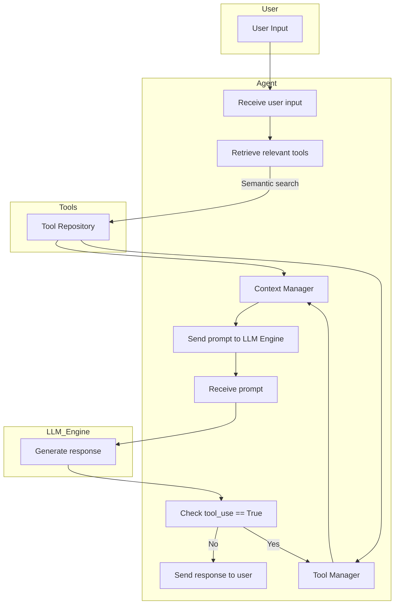

I'll help you define an implementation strategy for your AI framework based on the flowchart you've provided. Let's break this down into components, technologies, and a development plan.

## Technology Stack

1. **Core Framework**:
   - Python 3.9+ as the main progra
   - Pydantic for data validation and settings management

2. **LLM Integration**:
   - Ollama Python client library

3. **Tool Management**:
   - Function calling pattern implementation
   - JSON Schema for tool definitions

4. **Storage & Retrieval**:
   - Vector database for semantic search (Chroma)
   - PostgreSQL for persistent storage if needed
   - Embeddings generation using SentenceTransformers

## Step-by-Step Development Plan

### Phase 1: Core Architecture Setup

1. **Project Structure**:
   - Set up a modular project structure with clear separation of concerns
   - Implement configuration management for different environments

2. **LLM Engine Integration**:
   - Create an Ollama client wrapper
   - Implement prompt formatting and response parsing
   - Build a response streaming mechanism

3. **Basic Tool Framework**:
   - Define tool interface/abstract class
   - Create tool registration mechanism
   - Implement basic tool discovery

### Phase 2: Context & Tool Management

4. **Context Manager**:
   - Build a system for managing conversation history
   - Implement context window tracking
   - Create prompt assembly with relevant context

5. **Semantic Search**:
   - Set up embeddings generation pipeline
   - Implement vector storage and retrieval
   - Create relevance scoring mechanism

6. **Tool Manager**:
   - Build tool execution environment
   - Implement parameter validation
   - Create tool result processing

### Phase 3: Flow Control & Integration

7. **Flow Control**:
   - Implement the decision logic for tool use vs. direct response
   - Create retry and fallback mechanisms
   - Build error handling system

8. **Agent Loop**:
   - Implement the main agent loop following your flowchart
   - Add logging and observability
   - Create graceful termination

9. **API / Interface Layer**:
   - Build a CLI or API interface
   - Implement authentication if needed
   - Create response formatting options

### Phase 4: Testing & Refinement

10. **Testing Framework**:
    - Unit tests for each component
    - Integration tests for end-to-end flows
    - Create test fixtures and mocks

11. **Performance Optimization**:
    - Identify bottlenecks
    - Implement caching where appropriate
    - Optimize prompt templates

12. **Documentation**:
    - Create technical documentation
    - Write usage examples
    - Document tool development process

## Implementation Details for Key Components

### Context Manager
```python
# Conceptual implementation - not actual code
class ContextManager:
    def __init__(self, max_tokens=4000):
        self.history = []
        self.max_tokens = max_tokens
        
    def add_exchange(self, user_input, system_response):
        # Track token counts and manage history
        
    def get_relevant_context(self, query):
        # Return relevant context based on the query
        
    def build_prompt(self, query, system_message, relevant_tools):
        # Assemble complete prompt with context
```

### Tool Manager
```python
# Conceptual implementation - not actual code
class ToolManager:
    def __init__(self):
        self.tools = {}
        
    def register_tool(self, tool):
        # Register a new tool
        
    def get_tool_by_name(self, name):
        # Retrieve a specific tool
        
    def execute_tool(self, tool_name, parameters):
        # Execute the tool with parameters
        
    def get_tool_descriptions(self):
        # Get tool descriptions for the LLM
```

```bash
apollo/
├── src/
│   ├── __init__.py
│   ├── main.py                 # Entry point
│   ├── config.py               # Configuration management
│   ├── core/
│   │   ├── __init__.py
│   │   ├── agent.py            # Main agent loop implementation
│   │   ├── llm_engine.py       # Ollama integration layer
│   │   └── prompt_manager.py   # Prompt formatting and management
│   ├── context/
│   │   ├── __init__.py
│   │   ├── context_manager.py  # History and context tracking
│   │   └── memory.py           # Memory implementation
│   ├── tools/
│   │   ├── __init__.py
│   │   ├── base.py             # Base tool class/interface
│   │   ├── tool_manager.py     # Tool discovery and execution
│   │   └── implementations/    # Individual tools
│   │       ├── __init__.py
│   │       ├── search_tool.py
│   │       └── calculator_tool.py
│   ├── retrieval/
│   │   ├── __init__.py
│   │   ├── vector_store.py     # Vector DB interface
│   │   └── embeddings.py       # Embedding generation
│   └── api/                    # Optional API layer
│       ├── __init__.py
│       └── routes.py
├── tests/
│   ├── __init__.py
│   ├── test_agent.py
│   ├── test_tools.py
│   └── fixtures/               # Test data
├── scripts/
│   └── setup_environment.py
├── examples/
│   └── basic_conversation.py
├── pyproject.toml             # Dependencies and project metadata
├── README.md
└── .env.example               # Environment variables template
```

